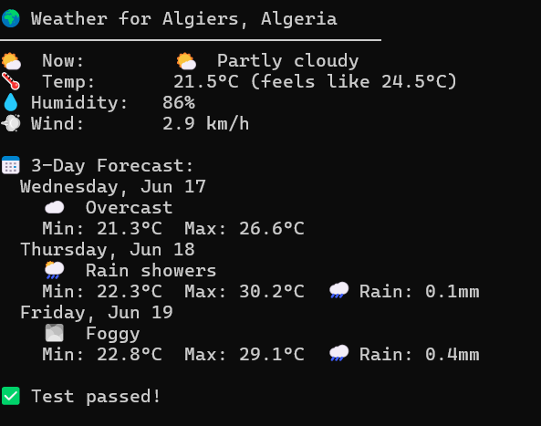
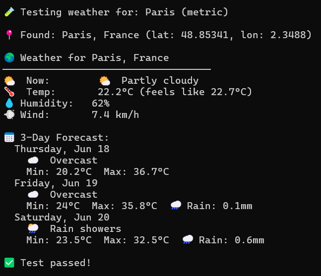
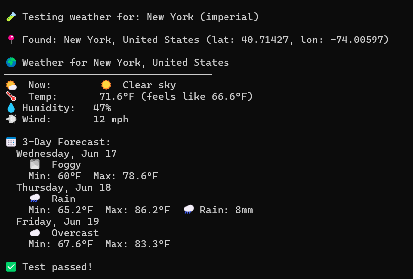
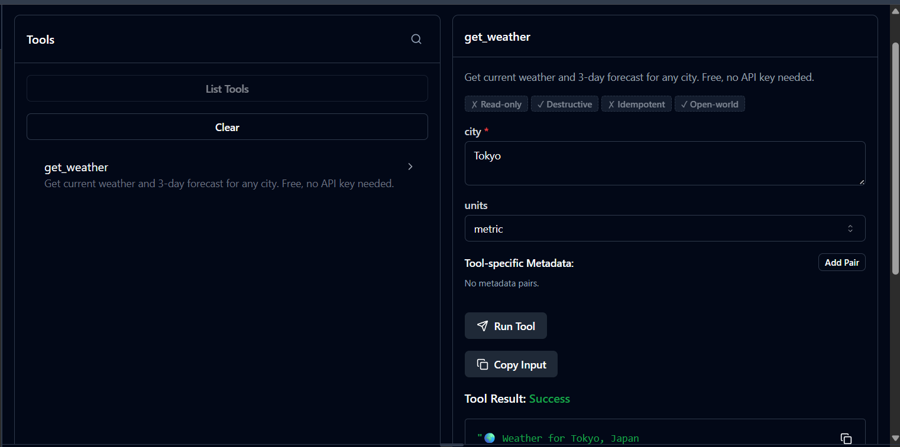
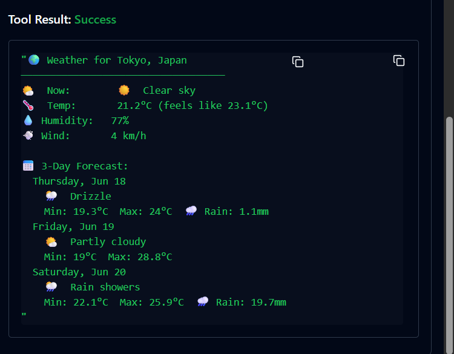

# 🌤️ Weather MCP Server

A **Model Context Protocol (MCP)** server that gives AI the superpower to fetch real-time weather for any city in the world, using the [Open-Meteo API](https://open-meteo.com/), which is 100% free with no API key needed.

---

## 📖 What is MCP?

**MCP (Model Context Protocol)** is an open standard created by Anthropic that allows AI models to connect to tools and data from the outside world, instead of only replying from what they were trained on.

Without MCP, an AI can only answer based on its training data. With MCP, you give it real superpowers:

| Without MCP | With MCP |
|-------------|----------|
| Static knowledge | Live data from APIs |
| No file access | Can read and write files |
| No system interaction | Can run shell commands |
| Frozen in time | Real-time information |

### How it works

```
You ask AI: "What's the weather in Algiers?"
         ↓
AI sees it has a tool called get_weather
         ↓
AI calls: get_weather({ city: "Algiers" })
         ↓
MCP server fetches the Open-Meteo API
         ↓
Returns real weather data as text
         ↓
AI reads it and answers you naturally
```

The MCP server is a Node.js process. The AI client launches it automatically and communicates through **stdin/stdout using JSON-RPC**. The AI never touches the API directly, it just calls your tool and reads the result.

---

## 🛠️ This Project : Weather MCP Server

This project builds an MCP server with one tool: **`get_weather`**.

### The tool

| Property | Value |
|----------|-------|
| **Name** | `get_weather` |
| **Description** | Get current weather and 3-day forecast for any city in the world |
| **API** | [Open-Meteo](https://open-meteo.com/) + [Open-Meteo Geocoding](https://open-meteo.com/en/docs/geocoding-api) |
| **API Key** | ❌ Not required completely free |

### How the API call works

The tool makes **two API calls** under the hood:

**Step 1 : Convert city name to coordinates (Geocoding API):**
```
GET https://geocoding-api.open-meteo.com/v1/search?name=Algiers&count=1
→ Returns: { latitude: 36.73, longitude: 3.08, country: "Algeria" }
```

**Step 2 : Fetch weather using coordinates (Weather API):**
```
GET https://api.open-meteo.com/v1/forecast?latitude=36.73&longitude=3.08
       &current=temperature_2m,humidity,wind_speed,weather_code
       &daily=temperature_2m_max,temperature_2m_min,precipitation_sum
→ Returns: live weather + 3-day forecast
```

### Parameters

| Parameter | Type | Required | Description |
|-----------|------|----------|-------------|
| `city` | string | ✅ Yes | Any city name — `Algiers`, `Paris`, `Tokyo`, `New York`... |
| `units` | enum | ❌ No | `metric` for °C (default) or `imperial` for °F |

### Example output

```
🌍 Weather for Algiers, Algeria
───────────────────────────────────
🌤️  Now:        ☁️  Overcast
🌡️  Temp:       21.5°C (feels like 24.5°C)
💧 Humidity:   86%
💨 Wind:       2.9 km/h

📅 3-Day Forecast:
  Thursday, Jun 18
    🌦️  Rain showers
    Min: 22.3°C  Max: 30.2°C  🌧️ Rain: 0.1mm
  Friday, Jun 19
    🌫️  Foggy
    Min: 22.8°C  Max: 29.1°C  🌧️ Rain: 0.4mm
  Saturday, Jun 20
    ☁️  Overcast
    Min: 21.0°C  Max: 27.5°C
```

---

## 📁 Project Structure

```
weather-mcp/
├── server.js       ← The MCP server defines the get_weather tool
├── test.js         ← Local test script runs without any AI
├── package.json    ← Project dependencies
└── README.md       ← This file
```

---

## 🚀 How to Run Everything

### Prerequisites

- [Node.js](https://nodejs.org/) v18 or higher check with `node -v`

### Step 1 : Install dependencies

Open a terminal inside the `weather-mcp` folder and run:

```bash
npm install
```

### Step 2 : Test the tool directly in the terminal

This runs the weather logic directly and prints real results, no AI, no inspector needed:

```bash
node test.js
```

---

## ✅ Results — It Works!

### Terminal test results

**Algiers, Algeria:**



**Paris, France:**



**New York, USA (imperial units):**



---

### Testing with MCP Inspector

MCP Inspector is an official Anthropic tool that gives you a browser UI to test your MCP server visually, without needing Claude Desktop or any AI subscription.

**Run it:**

```bash
npx -y @modelcontextprotocol/inspector node server.js
```

Open `http://localhost:5173` in your browser → click **Connect** → click **Tools** → select **get_weather** → fill in a city → click **Run Tool**.

**Inspector tool form:**



**Result for Tokyo, Japan:**



---

## 🤖 Connect to an AI (Optional)

### Claude Desktop (requires Claude Pro)

Find the config file:
- **Windows:** `%APPDATA%\Claude\claude_desktop_config.json`
- **macOS:** `~/Library/Application Support/Claude/claude_desktop_config.json`

Paste this (replace the path with your actual path):

```json
{
  "mcpServers": {
    "weather": {
      "command": "C:\\Program Files\\nodejs\\node.exe",
      "args": ["C:\\Users\\YOUR_USERNAME\\Desktop\\weather-mcp\\server.js"]
    }
  }
}
```

Save → fully quit Claude Desktop → reopen → look for the 🔧 icon in the chat input.

---

## ➕ How to Add a New Superpower

Want to give your MCP server more tools? Here's exactly how to do it, using a **currency converter** as an example.

### Step 1 : Add the tool in `server.js`

Open `server.js` and add a new `server.tool()` block after the existing `get_weather` tool:

```javascript
server.tool(
  "get_currency",                                        // tool name
  "Convert an amount from one currency to another.",     // description the AI reads
  {
    from: z.string().describe("Source currency code, e.g. USD, EUR, DZD"),
    to: z.string().describe("Target currency code, e.g. EUR, GBP, MAD"),
    amount: z.number().describe("Amount to convert"),
  },
  async ({ from, to, amount }) => {
    try {
      const data = await httpGet(
        `https://api.frankfurter.app/latest?amount=${amount}&from=${from}&to=${to}`
      );
      const result = data.rates[to];
      return {
        content: [{
          type: "text",
          text: `💱 ${amount} ${from} = ${result} ${to}`
        }]
      };
    } catch (err) {
      return { content: [{ type: "text", text: `❌ Error: ${err.message}` }] };
    }
  }
);
```

### Step 2 : Test it in the terminal

Add a test case to `test.js` and run:

```bash
node test.js
```

### Step 3 : Restart the Inspector or Claude Desktop

The new tool appears automatically, no rebuild needed.

---

### More superpower ideas

| Superpower | Free API | Example prompt for AI |
|------------|----------|-----------------------|
| 💱 Currency converter | [frankfurter.app](https://www.frankfurter.app/) | "Convert 100 USD to DZD" |
| 🌍 Country info | [restcountries.com](https://restcountries.com/) | "Tell me about Algeria" |
| 📰 Latest news | [newsapi.org](https://newsapi.org/) | "What's in the news today?" |
| 🎬 Movie info | [omdbapi.com](https://www.omdbapi.com/) | "Tell me about Interstellar" |
| 😂 Random joke | [v2.jokeapi.dev](https://v2.jokeapi.dev/) | "Tell me a programming joke" |
| 🗺️ IP location | [ip-api.com](https://ip-api.com/) | "Where is IP 8.8.8.8 located?" |

Every new tool follows the same 3-step pattern: **define → test → done**.

---

## 📚 Resources

- [MCP Official Docs](https://modelcontextprotocol.io)
- [MCP TypeScript SDK](https://github.com/modelcontextprotocol/typescript-sdk)
- [Open-Meteo API Docs](https://open-meteo.com/en/docs)
- [MCP Inspector](https://github.com/modelcontextprotocol/inspector)

---
